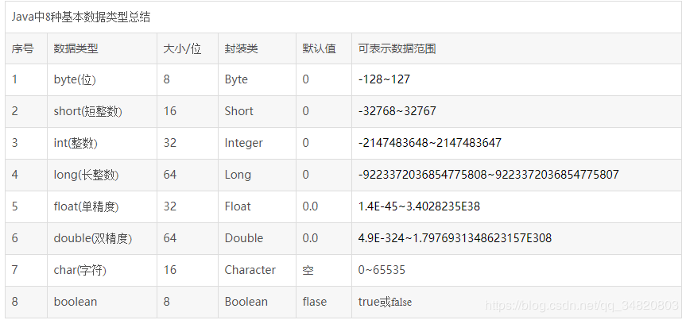
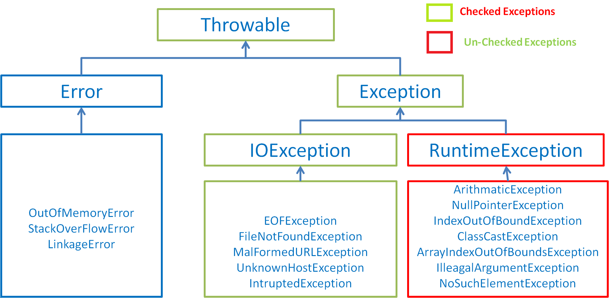
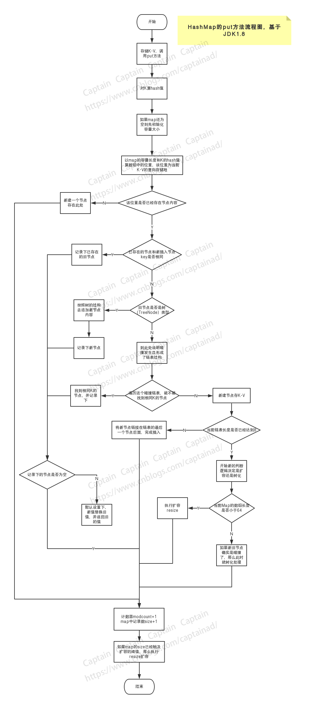
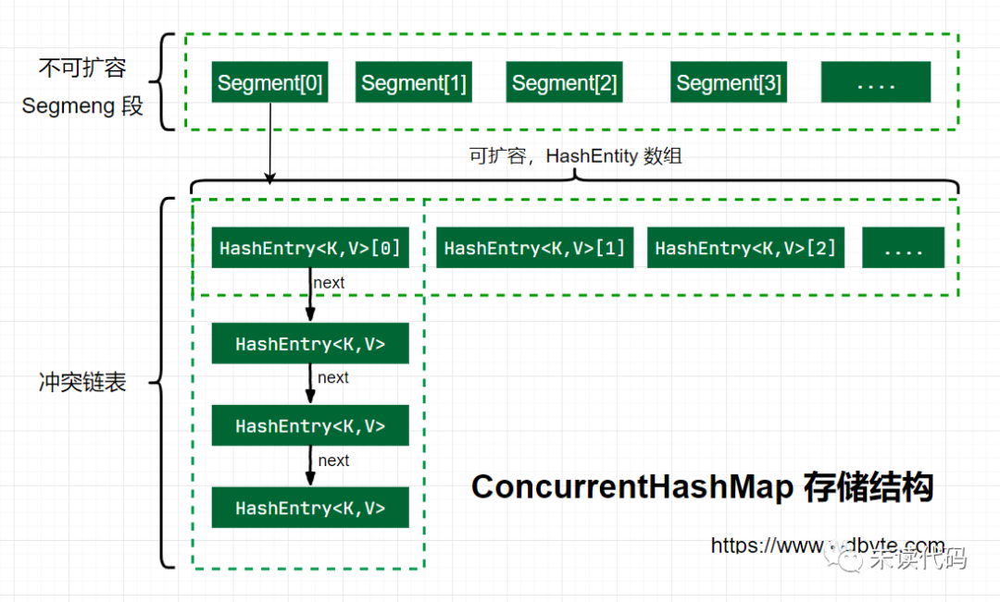
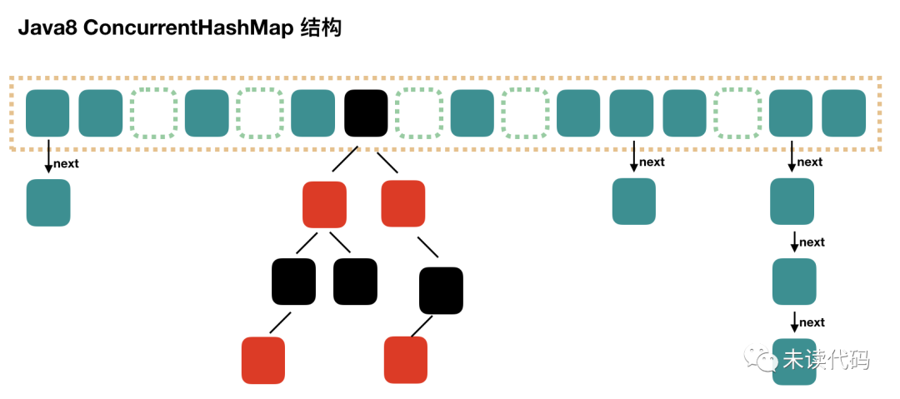

## Java

[TOC]

### :peach:Java基础

#### Java什么时候会死锁，如何避免

线程死锁：多个线程由于等待资源释放，被无限期阻塞，程序不能正常终止。

##### 1 死锁的四个条件

1. **互斥条件**：资源任意时刻只能由一个线程占用
2. **请求与保持**：线程因请求资源而阻塞时，不释放已获得的资源
3. **不剥夺条件**：线程已获得的资源在未使用完时，不能被其他线程剥夺
4. **循环等待条件**：线程形成头尾相接的循环等待资源关系

##### 2 如何避免死锁

1. **破坏**互斥条件：:negative_squared_cross_mark:
2. **破坏**请求与保持：一次性申请所有资源
3. **破坏**不剥夺条件：占用资源的线程申请其他资源时，如果申请不到，可以主动释放它占有的资源
4. **破坏**循环等待条件：靠按序申请资源。规定所有的线程申请资源必须以一定的顺序，释放顺序与之相反，来避免循环等待

---

#### 面向对象的三大特征

- 面向对象三大特性：**封装、继承、多态**
- **封装**：把一个对象的信息隐藏在对象内部，不允许外部对象直接访问对象的内部信息。但可以提供一些可以被外界访问的方法，访问内部属性
- **继承**：继承是使用已存在的类的定义作为基础，建立新类的技术。新类的定义可以增加新的数据或新的功能，也可以用父类的功能，但不能选择性地继承父类
- **多态**：即一个引用变量所**指向的具体类型**，和通过该引用变量发出的**方法调用**，在编程时不确定，在**程序运行期间**才能确定；增加了程序的**灵活性**

---

#### 基本数据类型及其包装类，区别

**1 基本数据类型及其包装类**



**2 区别**

1. 包装类型是对象，有用方法和字段，对象的调用都是通过引用对象的地址。基本类型不是
2. 包装类型是引用的传递，基本类型是值得传递
3. 声明方式不同，包装类型要用New
4. 存储位置不同，基本数据类型保存在值栈中，包装类型把对象放在堆中
5. 初始值不同，包装类型初始值为null
6. 使用方式不同，基本数据类型直接赋值使用，包装类型通常在集合中使用

---

#### 接口和抽象类的区别

1. 接口的方法默认是 public，所有方法在接口里不能有默认实现（JDK8开始，可以有默认实现）。而抽象类可以有非抽象的方法
2. 接口中除了 final和static变量，不能有其他变量。抽象类不一定
3. 类可以实现多个接口，但只能继承一个抽象类
4. 接口方法默认修饰符是public，抽象类方法修饰符可以是public/protected/default
5. 从设计层面来说，抽象类是对类的抽象，是一种模板设计；接口是对行为的抽象，是一种行为规范

---

#### Java范型

范型提供了**编译时类型安全的检查机制**，允许程序员在编译时检测到非法的类型。范型的本质是**参数化类型**，也就是说操作的类型数据被指定为一个参数。常见的就是范型方法/范型类/类型通配符

https://www.runoob.com/java/java-generics.html

---

#### Java异常

- Java中的所有异常都有一个共同祖先，java.lang.**Throwable类**。Throwable 有两个重要的子类：**Exception（异常）** 和 **Error（错误）**

- **Error **表示程序无法处理的错误。大多数都与代码编写者执行的操作五官，而表示代码运行时JVM出现的问题。
- **Expection**是程序可以处理的异常，分为**运行时异常（RuntimeException，不受检异常：还包括Error)**和**编译异常（IOException，受检异常）**
  - **RuntimeException **表示JVM在运行期间可能出现的异常，如数组下标越界`（ArrayIndexOutBoundException）`。这类异常一般由程序逻辑错误引起，可以选择捕获处理，也可以不处理。
  - **IOException **是编译器要求必须处理的异常，否则编译不通过。



---

#### String和StringBuilder、StringBuffer区别

1. 底层实现

   - String底层是final修饰的字符数组（JDK1.9字符数组变为byte数组），所以String对象不可变

   - StringBuilder和StringBuffer都继承自AbstractStringBuilder，底层是char[]，可变

2. 线程安全性

   - Sring不可变，线程安全
   - StringBuilder线程不安全
   - StringBuffer在AbstractStringBuilder基础上加了同步锁，线程安全

3. 性能

   - 每次对String对象的修改，都会创建一个新的String对象
   - StringBuilder和StringBuffer都是对本身进行修改，StringBuilder不需加锁，性能略高

总结：

1. 操作少量的不变数据：String
2. 单线程下操作大量数据：StringBuilder
3. 多线程下操作大量数据：StringBuffer

---

### :peach:容器

#### 1 HashMap底层实现，JDK1.8前后

**1.1 JDK1.8之前**

底层结构为**数组+链表**组合，即**链表散列**。key的hashcode经过扰动函数处理后，得到hash值，然后通过 **(n-1)&hash** （n为数组长度）判断当前元素存放的位置。若当前位置存在元素的话，判断该元素与要存入的元素hash和key值是否相同，相同直接覆盖，不同则通过拉链法解决冲突。注意链表的插入是以**头插法**进行的。


**解释(n-1)&hash**：

HashMap的长度为2的幂次方时，等式**hash % n =（n-1）& hash** 成立 ，且二进制操作速度更快

**1.2 JDK1.8之后**

与之前相比，在解决哈希冲突时，当链表长度大于阈值（默认8），将链表转化为红黑树，以减少搜索时间。但是在转化为红黑树前，会进行判断，若当前数组长度小于64，则会先扩容，而不是转换为红黑树。


---

#### 2 HashMap扩容

HashMap扩容流程：

1. 获取旧的`table`长度和`threshold`，进行`newCap`和`newThr`的初始化，分为以下几种情况
   - `table`不为空，若`table长度>=最大容量`，不扩容，令`threshold=Integer.MAX_VALUE`；若 `默认初始容量=<table长度`且`table长度*2<=最大容量`，`newThr=oldThr<<1`
   - table为空，即进行table初始化。若创建HashMap时用的带参的构造方法，则由于构造方法中的 `this.threshold = tableSizeFor(initialCapacity)`，`oldThr=threshold>0`，此时令`newCap=oldThr`
   - 若利用无参构造函数，`newCap`和`newThr`都用默认值赋值
2. 初始化过程中，`newThr`可能为0，利用`newCap`和`loadFactor`对其赋值
3. 判断`old Table`是否为空，如果为空直接返回`new Table`。否则依次遍历旧`old table`中的元素，将其迁移到扩容后的`new table`中，分为以下几种情况：
   - 数组对应位置只有一个元素，对其hash值取余（`e.hash & (newCap - 1)`）放到新table的对应位置。
   - 数组对应位置是红黑树，将红黑树拆分到`new table`中，如果拆分后的红黑树元素个数小于6，转化为链表
   - 数组对应位置是链表，根据`(e.hash & oldCap)`条件对链表进行拆分并放到`newTable`

```java
//方法作用：初始化或扩容 
final Node<K,V>[] resize() {
        Node<K,V>[] oldTab = table;
        //获取旧table的长度
        int oldCap = (oldTab == null) ? 0 : oldTab.length;
        //获取旧的扩容阈值
        int oldThr = threshold;
        int newCap, newThr = 0;
        //oldTab!=null,则oldCap>0
        if (oldCap > 0) {
            //如果旧table长度>=最大容量限制时不进行扩容，并将扩容阈值赋值为Integer.MAX_VALUE
            if (oldCap >= MAXIMUM_CAPACITY) {
                threshold = Integer.MAX_VALUE;
                return oldTab;
            }
            //如果(当前容量*2<最大容量&&当前容量>=默认初始化容量（16）)
            //并将将原容量值<<1(相当于*2)赋值给 newCap
            else if ((newCap = oldCap << 1) < MAXIMUM_CAPACITY &&
                     oldCap >= DEFAULT_INITIAL_CAPACITY)
                //如果能进来证明此map是扩容而不是初始化
                newThr = oldThr << 1; // double threshold
        }
    	//进入此if证明创建map时用的带参构造：public HashMap(int initialCapacity)或 public HashMap(int initialCapacity, float loadFactor)
        //注：带参的构造中initialCapacity（初始容量值）不管是输入几都会通过 “this.threshold = tableSizeFor(initialCapacity);”此方法计算出接近initialCapacity参数的2^n来作为初始化容量（初始化容量==oldThr）
        else if (oldThr > 0) // initial capacity was placed in threshold
            newCap = oldThr;
    	//进入此if证明创建map时用的无参构造
        else {               // zero initial threshold signifies using defaults
            newCap = DEFAULT_INITIAL_CAPACITY;
            newThr = (int)(DEFAULT_LOAD_FACTOR * DEFAULT_INITIAL_CAPACITY);
        }
    	 //进入此if有两种可能
         // 第一种：进入此“if (oldCap > 0)”中且不满足该if中的两个if
         // 第二种：进入这个“else if (oldThr > 0)”
        if (newThr == 0) {
            float ft = (float)newCap * loadFactor;
            newThr = (newCap < MAXIMUM_CAPACITY && ft < (float)MAXIMUM_CAPACITY ?
                      (int)ft : Integer.MAX_VALUE);
        }
        threshold = newThr;

        @SuppressWarnings({"rawtypes","unchecked"})
        //将旧table中的元素放到扩容后的newTable中
        Node<K,V>[] newTab = (Node<K,V>[])new Node[newCap];
        table = newTab;
    //如果“oldTab != null”说明是扩容，否则直接返回newTab
        if (oldTab != null) {
            for (int j = 0; j < oldCap; ++j) {
                Node<K,V> e;
                if ((e = oldTab[j]) != null) {
                    oldTab[j] = null;
                    //如果数组对应下标位置只有一个元素，对hashCade取余并根据结果直接放到newTable相应的位置
                    if (e.next == null)
                        newTab[e.hash & (newCap - 1)] = e;
                        //如果数组对应下标位置的元素是一个红黑树,则拆分红黑树放到newTable中
                        // 如果拆分后的红黑树元素小于6，则转化为链表
                    else if (e instanceof TreeNode)
                        ((TreeNode<K,V>)e).split(this, newTab, j, oldCap);
                    else { // preserve order
                    //数组对应下标位置的元素是一个链表的情况
                    //根据(e.hash & oldCap)条件对链表进行拆分并放到newTable
                        Node<K,V> loHead = null, loTail = null;
                        Node<K,V> hiHead = null, hiTail = null;
                        Node<K,V> next;
                        do {
                            next = e.next;
                            if ((e.hash & oldCap) == 0) {
                                if (loTail == null)
                                    loHead = e;
                                else
                                    loTail.next = e;
                                loTail = e;
                            }
                            else {
                                if (hiTail == null)
                                    hiHead = e;
                                else
                                    hiTail.next = e;
                                hiTail = e;
                            }
                        } while ((e = next) != null);
                        if (loTail != null) {
                            loTail.next = null;
                            newTab[j] = loHead;
                        }
                        if (hiTail != null) {
                            hiTail.next = null;
                            newTab[j + oldCap] = hiHead;
                        }
                    }
                }
            }
        }
        return newTab;
    }
```

---

#### 3 HashMap put一个数据的流程

https://www.cnblogs.com/captainad/p/10905184.html

put方法通过调用 **putVal()** 进行添加元素

**putVal()** 添加元素的具体过程如下：

1. 计算得到**`key`的`hash`值**，判断**`table`是否为空**，若**空先`resize`**，初次默认大小为**16**
2. 判断定位到的**数组位置是否为空**，空则直接插入
3. 若有元素 `p`，就和要插入的`key`比较。若**`key`相同直接覆盖**，然后**返回旧值。**
4. 若不同，则**判断`p`是否为一个树节点**。如果是，就调用**`putTreeVal`**方法将元素插入，**返回旧值**。否则**遍历链表**，若有`key`相同的节点，覆盖后返回旧值。
5. 若遍历链表没有相同的节点，则在**链表尾部插入**。然后**判断是否转化为红黑树**。当链表长度达到8时，如果**`table`为空或者长度小于`64`**，则**`resize`**。否则转化为红黑树
6. 最后，**`modCount++`，如果`++size>threshold`，则扩容**



```java
public V put(K key, V value) {
    return putVal(hash(key), key, value, false, true);
}

final V putVal(int hash, K key, V value, boolean onlyIfAbsent,
                   boolean evict) {
    Node<K,V>[] tab; Node<K,V> p; int n, i;
    // table未初始化或者长度为0，进行扩容
    if ((tab = table) == null || (n = tab.length) == 0)
        n = (tab = resize()).length;
    // (n - 1) & hash 确定元素存放在哪个桶中，桶为空，新生成结点放入桶中(此时，这个结点是放在数组中)
    if ((p = tab[i = (n - 1) & hash]) == null)
        tab[i] = newNode(hash, key, value, null);
    // 桶中已经存在元素
    else {
        Node<K,V> e; K k;
        // 比较桶中第一个元素(数组中的结点)的hash值相等，key相等
        if (p.hash == hash &&
            ((k = p.key) == key || (key != null && key.equals(k))))
                // 将第一个元素赋值给e，用e来记录
                e = p;
        // hash值不相等，即key不相等；为红黑树结点
        else if (p instanceof TreeNode)
            // 放入树中
            e = ((TreeNode<K,V>)p).putTreeVal(this, tab, hash, key, value);
        // 为链表结点
        else {
            // 在链表最末插入结点
            for (int binCount = 0; ; ++binCount) {
                // 到达链表的尾部
                if ((e = p.next) == null) {
                    // 在尾部插入新结点
                    p.next = newNode(hash, key, value, null);
                    // 结点数量达到阈值，转化为红黑树
                    if (binCount >= TREEIFY_THRESHOLD - 1) // -1 for 1st
                        treeifyBin(tab, hash);
                    // 跳出循环
                    break;
                }
                // 判断链表中结点的key值与插入的元素的key值是否相等
                if (e.hash == hash &&
                    ((k = e.key) == key || (key != null && key.equals(k))))
                    // 相等，跳出循环
                    break;
                // 用于遍历桶中的链表，与前面的e = p.next组合，可以遍历链表
                p = e;
            }
        }
        // 表示在桶中找到key值、hash值与插入元素相等的结点
        if (e != null) { 
            // 记录e的value
            V oldValue = e.value;
            // onlyIfAbsent为false或者旧值为null
            if (!onlyIfAbsent || oldValue == null)
                //用新值替换旧值
                e.value = value;
            // 访问后回调
            afterNodeAccess(e);
            // 返回旧值
            return oldValue;
        }
    }
    // 结构性修改
    ++modCount;
    // 实际大小大于阈值则扩容
    if (++size > threshold)
        resize();
    // 插入后回调
    afterNodeInsertion(evict);
    return null;
} 
```

---

#### 4 HashMap是否线程安全

JDK1.7： https://coolshell.cn/articles/9606.html

不安全，jdk1.7的HashMap在并发环境下，扩容时由于头插法，会产生环形链表

JDK1.8 ：不安全，并发put时会发生数据覆盖的情况

---

#### 5 ConcurrentHashMap线程安全的原理，JDK1.8前后

**5.1 ConcurrentHashMap JDK1.7**

- **Segment 数组 + HashEntry 数组 + 链表：**一个`ConcurrentHashMap`维护一个`Segment数组`，一个 `Segment` 维护一个`HashEntry数组`。`Segment` 内部可以进行扩容，但是`Segment`的个数一旦初始化就不能改变。默认的`Segment`个数为16。
- 在安全方面，使用**分段锁**，每个 `Segment` 上同时只有一个线程可以操作。**Segment继承了ReentrantLock**，所以它也是一种**可重入锁**



**5.2 ConcurrentHashMap JDK1.8**

- 底层结构不再是之前的 **Segment 数组 + HashEntry 数组 + 链表**，而是 **Node 数组 + 链表 / 红黑树**。当冲突链表达到一定长度时，链表会转换成红黑树。
- 在安全上使用**Synchronized+CAS**机制，`synchronized`只锁定当前链表或红黑树的首节点，这样只要哈希不冲突，就不会产生并发



---

#### 6 ConcurrentHashMap和HashTabel区别

1. **底层数据结构**
   - JDK 1.7 的ConcurrentHashMap底层采用 **Segment 数组 + HashEntry 数组 + 链表**，JDK1.8底层采用**node+链表/红黑树**。
   - 而HashTable和 JDK 1.8之前的HashMap结构类似，都是采用**数组+链表**的形势
2. **实现线程安全的方式**
   - JDK 1.7 的ConcurrentHashMap通过**分段锁**实现线程安全，JDK1.8抛弃了Segment的概念，通过**synchronized和CAS**实现并发控制。
   - HashTable使用**synchronized**实现线程安全，同一时间只能由一个线程访问同步方法，效率低下

---

#### 7 TreeMap和HashMap适用场景

 **TreeMap和HashMap比较：**

- `TreeMap` 和`HashMap` 都继承自`AbstractMap` ，但是需要注意的是`TreeMap`它还实现了`NavigableMap`接口和`SortedMap` 接口。

- 实现 `NavigableMap` 接口让 `TreeMap` 有了对集合内元素的搜索的能力。

- 实现`SortMap`接口让 `TreeMap` 有了对集合中的元素根据键排序的能力。默认是按 key 的升序排序，不过我们也可以指定排序的比较器。

**适用场景：**

当希望得到有序的结果时，应该使用TreeMap。除此之外，由于HashMap有更好性能，所以大多不需要排序的时候都用HashMap

---

#### （Map一个线程正在扩容，另一个线程在加数据，另一个在删数据，如何处理？）（扩容时有put操作怎么办）

---

### :peach:其他