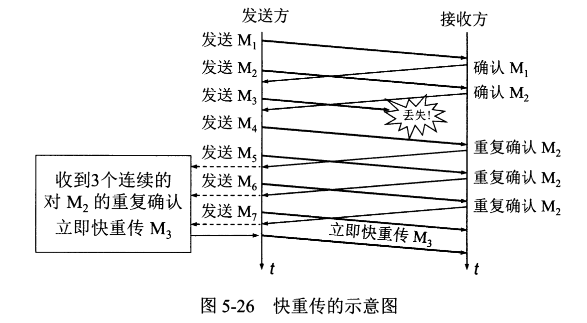
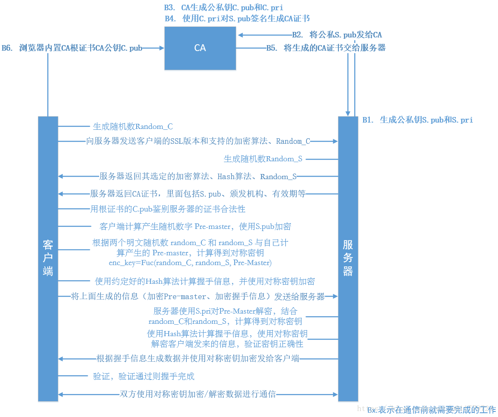

## 计算机网络

[TOC]

#### http访问页面的流程

https://segmentfault.com/a/1190000006879700

1. DNS解析：域名—>IP地址（**DNS协议**）

   本地域名服务器—根域名服务器—顶级域名服务器—主域名服务器

   

   **DNS缓存：**浏览器缓存—>JVM DNS缓存—>本机操作系统缓存—>路由器缓存—>根域名服务器缓存—>COM顶级域名服务器缓存—>主域名服务器缓存

2. TCP连接（**TCP协议**）

3. 发送HTTP请求（HTTPS传送数据前进行加密）

   **IP：**TCP建立连接后，发送数据在网络层使用IP协议

   **OSPF **(Open shortest path first)：IP数据包在路由选择时使用该协议

   **ARP：**路由器与服务器通信时，将IP地址转换为MAC地址的协议

   **HTTP：**应用层传输协议

4. 服务器处理HTTP请求并返回HTTP报文

5. 浏览器解析渲染页面

6. 连接结束

---

#### OSI七层模型

- **应用层**：通过进程间的交互，来完成特性的网络应用。应用层定义的是应用进程间通信和交互的规则
  - 协议：如**域名系统DNS**，支持万维网应用的 **HTTP协议**，支持电子邮件的 **SMTP协议**

---

#### TCP三次握、四次挥手

https://blog.csdn.net/qzcsu/article/details/72861891

---

#### TCP滑动窗口原理，作用

**作用**：实现流量控制，控制发送方的发送速率，保证接收方来得及接受

**原理**：

- 发送方和接收方各有一个窗口，用来暂时存放字节流。窗口内的字节都允许被发送or接收
- 接收方通过TCP报文中的窗口字段，告诉发送方自己的窗口大小，发送方依此设置自己窗口大小
- 发送方的窗口，会不断右滑，直到第一个字节不是已发送且已确认的状态。
- 接收方同理，但是只对窗口内**按序到达**的最后一个字节进行确认。

---

#### TCP拥塞控制方法

- **慢开始**：当开始一个连接时，用单个报文作为单位，设置拥塞窗口（cwnd）大小为1，如果确认到达且未丢失，则翻倍增长，变为2个、4个…直到到达慢开始门限ssthresh，进入拥塞避免

- **拥塞避免**：设置慢开始门限ssthresh，`cwnd<ssthresh`时，慢开始；`cwnd>=ssthresh`时，使用拥塞控制算法，停用慢开始，cwnd每次加1。如果出现了超时，另`ssthresh=cwnd/2`，重新执行慢开始

- **快重传**：接收方收到一个比期望序号大的报文段以后，便会重复最近一次确认的报文段的确认信号，直到3次以后，发送端会知道该报文段丢失，于是重新发送，而不用等到超时再重传。

- **快恢复**：发送方收到3个重复确认时，将慢开始门限`ssthresh=cwnd/2`，`cwnd=ssthresh`，然后执行拥塞避免算法，使拥塞窗口慢慢变大

---

#### HTTP GET和POST

- 二者本质上没有区别，都是HTTP协议中**两种请求方式**，只有报文格式不同
- 根据规范，`get`将参数放在`url`中，`post`放在`requestBody`中
- 由于浏览器限制`url`长度，所以`get`参数长度会受到限制

---

#### HTTP和HTTPS的区别

1. **端口**：HTTP的URL由“http://”起始且默认使用端口80，而HTTPS的URL由“https://”起始且默认使用端口443
2. **安全性和资源消耗**：
   - HTTP运行在TCP之上，明文传输，通信双方无法验证对方身份
   - HTTPS运行在SSL/TLS之上，SSL/TLS运行在TCP之上，通过对称加密传输，但是对称加密的密钥通过服务器的证书，进行了非对称加密。所以HTTPS安全性和资源消耗都高于HTTP

---

#### 介绍HTTPS及其加密过程

- `HTTPS = HTTP + TLS/SSL协议`，`HTTPS`协议让`HTTP`先和`SSL（Secure Sockets Layer）`通信，再由`SSL`和`TCP`通信，具有**加密（防窃听）**、**认证（防伪装）**和**完整性保护（防报文篡改）**的功能 

##### **5.1 加密过程**

- 对称加密的问题：如何安全将秘钥传到解密方。
- 非对称加密：细节繁琐,速度太慢

**证书申请及验证：**

- 服务端生成公私秘钥，将秘钥和信息发送给CA（Certificate Authority），CA根据信息生成证书。
- 对于服务器公钥，CA根据数字摘要算法，生成数字指纹，再用CA私钥对数字指纹进行加密，生成数字签名。
- 证书包含：网站地址，加密公钥，证书的颁发机构（CA），签名算法，签名等
- 客户端验证证书的时候，用CA证书的公钥，解密签名得到数字指纹A，然后对证书的服务器公钥进行数字摘要算法，生成数字指纹B，比较数字指纹A和B是否相等=》相等，说明证书内容未被篡改=》验证证书有效期和域名等

**SSL四次握手**：

- https://www.jianshu.com/p/cf2f86bc597a 解释了下图

1. 客户端生成`Random_C`，将随机数`Random_C`、自己支持的SSL版本号、加密算法等信息发送给服务器

2. 服务器生成`Random_S`，将随机数`Random_S`、选定的加密算法、`Hash`算法、CA证书等发给客户端

3. 客户端用CA公钥验证证书的有效性

   =》生成随机数`Pre-master secret，利用Random_C、Random_S、Pre-master key`计算得到对称秘钥

   =》使用约定的`Hash`算法计算握手信息，用对称秘钥加密

   =》客户端使用`change cipher spec`通知server端开始使用加密报文传输数据

   =》客户端将加密的握手信息，和用证书中的`S.pub`加密后的`Pre-master secret`发给服务器。

4. 服务器用`S.pri`解密`Pre-master secret`，结合`Random_C、Random_S`计算得到对称秘钥

   =》使用约定的`Hash`算法计算握手信息

   =》用计算所得对称秘钥解密客户端发来的信息，验证秘钥正确性

   =》服务端传输改变通知（Change Chiper Spec）

   =》根据握手信息生成数据，并使用对称秘钥加密，发给客户端

   =》验证完毕，双方通过对称秘钥 加密/解密数据进行通信

   

